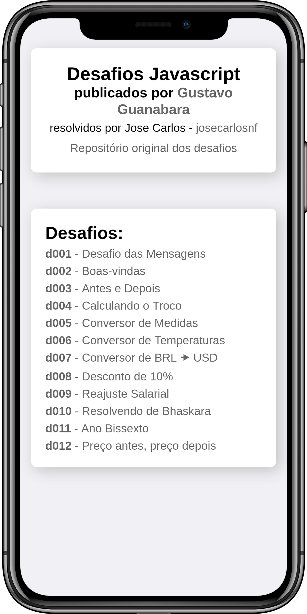

# Resolução dos Desafios Javascript

## Demonstração das respostas em https://josecarlosnf.github.io/resolucao-javascript-guanabara

  
  

## Curso de Javascript por [Gustavo Guanabara](https://github.com/gustavoguanabara)

- [Site do Curso](https://gustavoguanabara.github.io/javascript/)
- [Repositório do Curso](https://github.com/gustavoguanabara/javascript/)